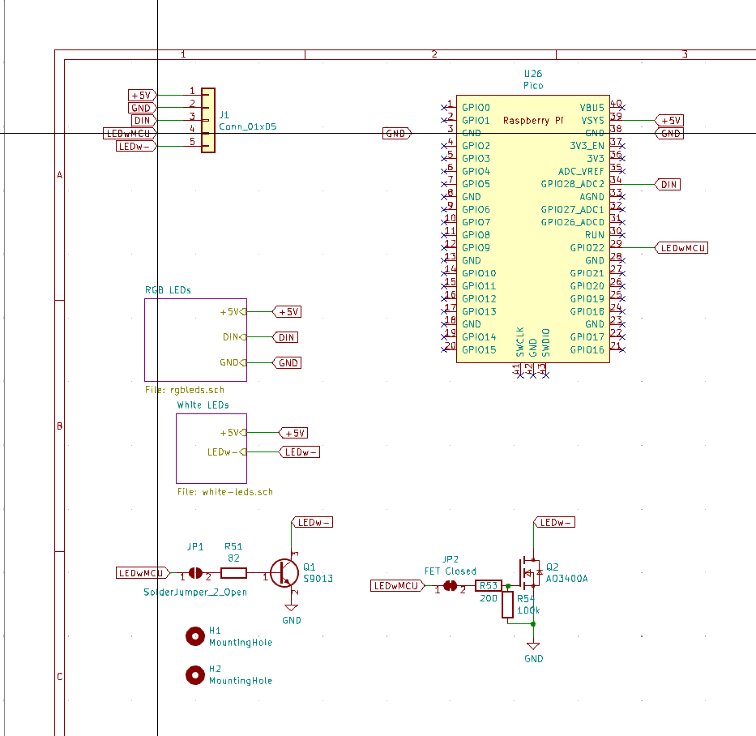
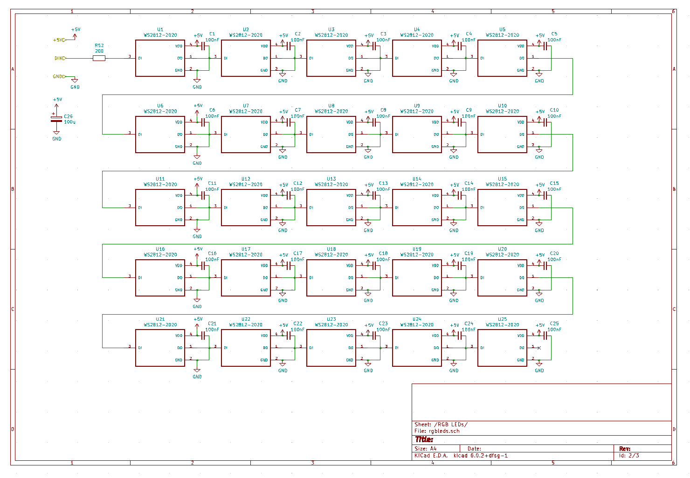
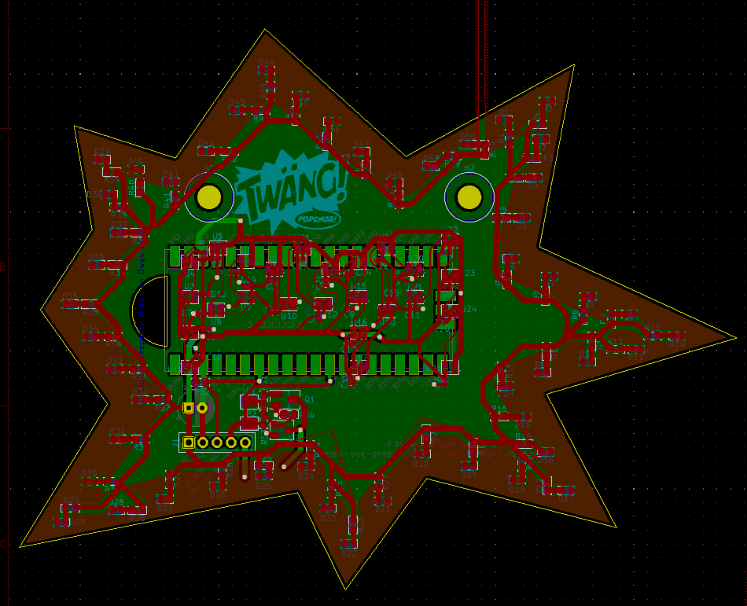
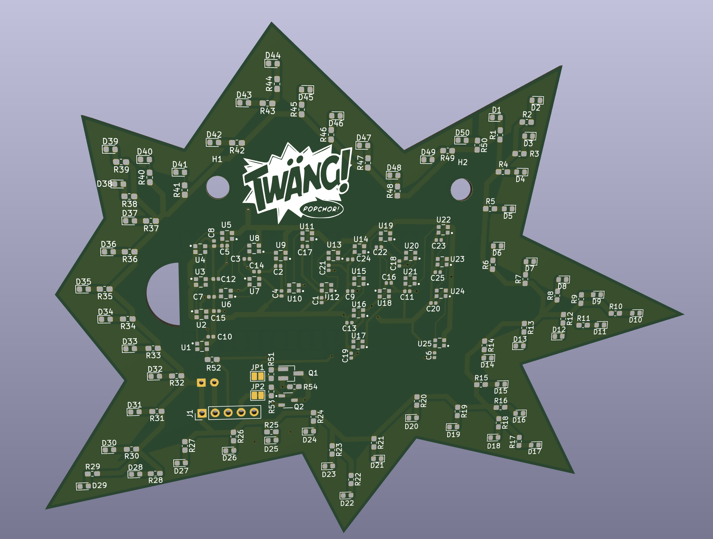
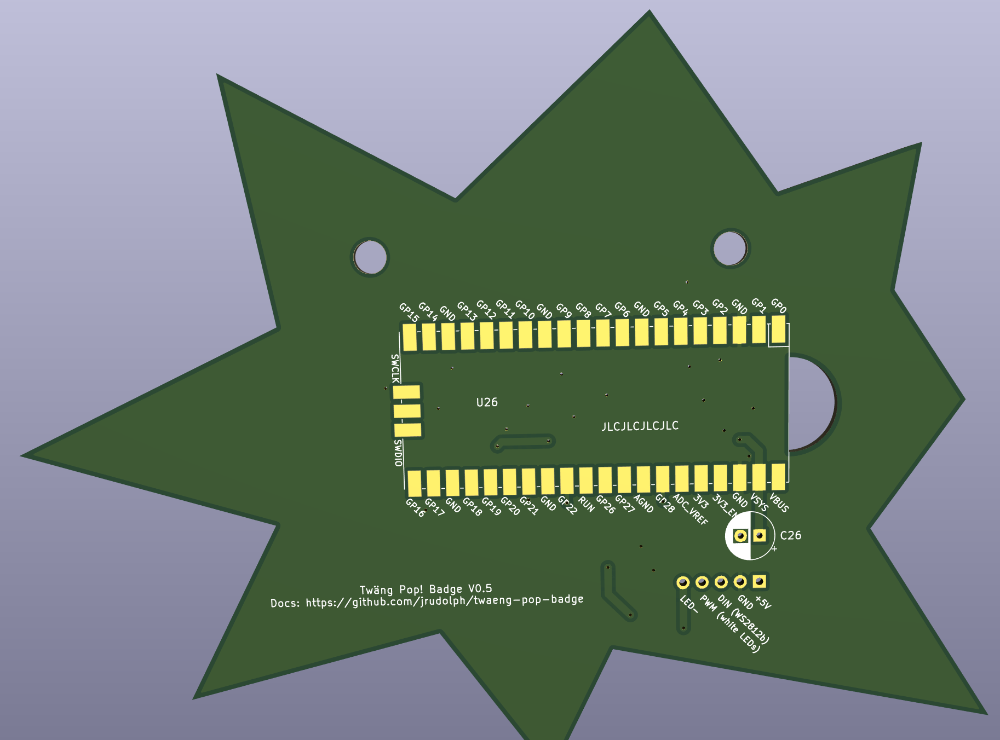

# Twang POP! Badge

These are [KiCad](https://www.kicad.org/) sources from which the Twang POP! Badge was produced. This
is basically version 2 of the blinky sign described [on the blog](https://blog.virtual-void.net/2022/06/17/creating-a-blinky-sign-for-twaeng/).

## Schematics

The idea was to keep the basic original design based around a RPi Pico and WS2812b LEDs. For space and
cost reasons the amount of WS2812 LEDs was reduced to 25 and the smaller variant was chosen. Additionally, 50 simple white LEDs were
added as a frame for the sign. These LEDs can not be controlled individually but only as the whole set. The brightness can be set by choosing appropriate PWM settings. 50 LEDs could consume 1A of
current which is a lot and cannot be sourced from a microcontroller pin directly. Since this was my first
electronics design, I was not totally certain how to set this up properly, so I went with a design, where I put both an NPN-transistor and an N-channel MOSFET on the board configurable via solder
jumpers. I also put a debug header on the board for easy testing of components without requiring to
immediately solder the RPi Pico.

The Pico itself is soldered to the back using its castellated edges. The idea is here, to piggy-back
on the proven design of the Pico and avoid experimenting with a full-fledged MCU design. The Pico has a very flexible input power design based on a switching buck/boost converter, so you can either run via USB or any other power source like AA batteries within a wide range of voltages.

The LED setup is schematically simple:

RGB LEDs:

White LEDs:

## PCB

The PCB has the outline of speech bubble in the form of a star. It uses a two layer design
with most of the back being the ground plane with a small amount of via connections.

On the front are all the LEDs with the required support components. The white LEDs are switched on the low-side (via the N-channel MOSFET), so the outer frame is a fill which goes to the source of the MOSFET. I read that having loops on a PCB will more likely act as an antenna, so I spared out a bit of the fill in the upper-right corner. The anode of the LEDs is directly connected to 5V. The MOSFET is controlled via a MCU pin, using PWM to dim the LEDs. They will never be driven with full power, which would use `50 x 20mA = 1A` (and would be even more blindingly bright).

Here's KiCad's 3D rendering of the front:

On the back there is room to solder the Pico itself to the board, and an electrolytic capacitor to relieve the power source (but it also works reliably without), so I didn't actually place them.

## Final Result

