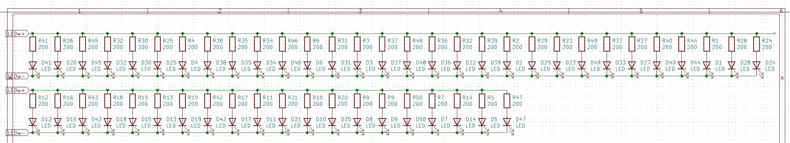
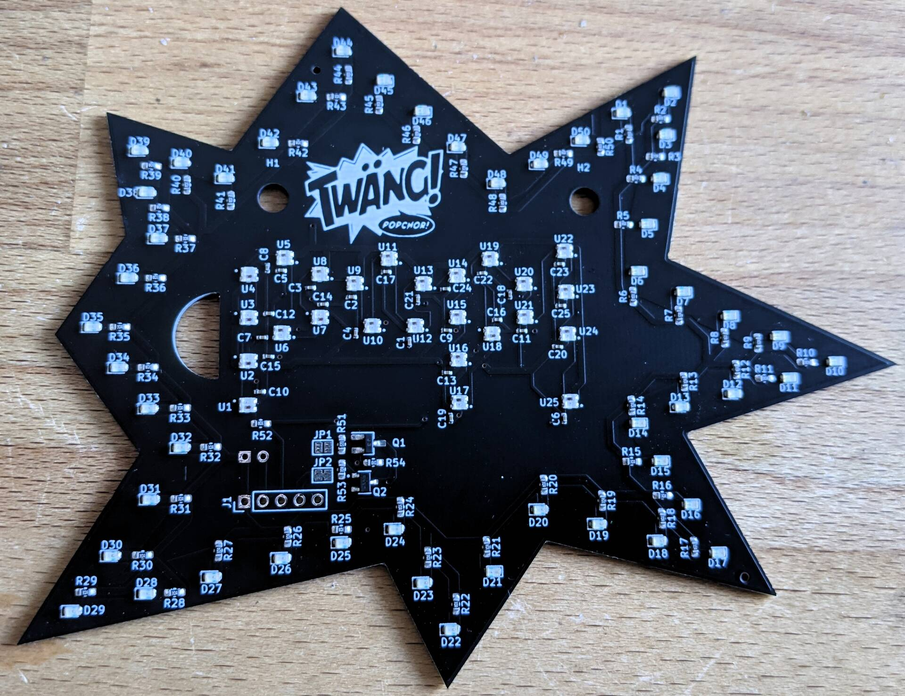
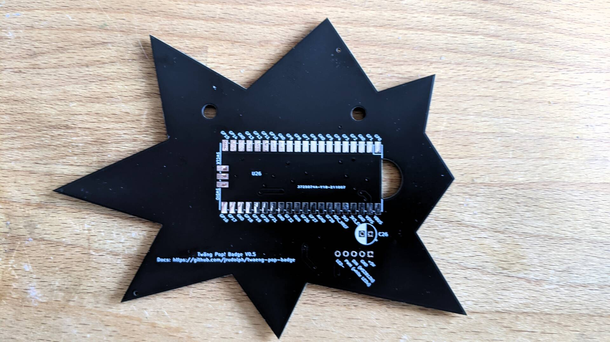
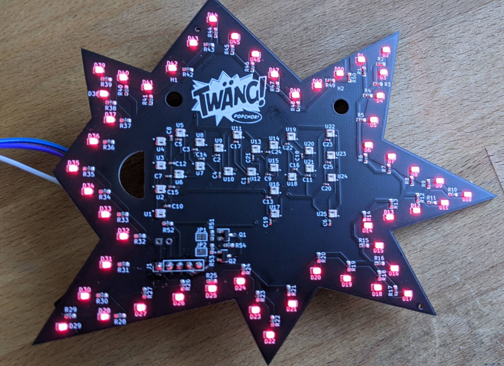
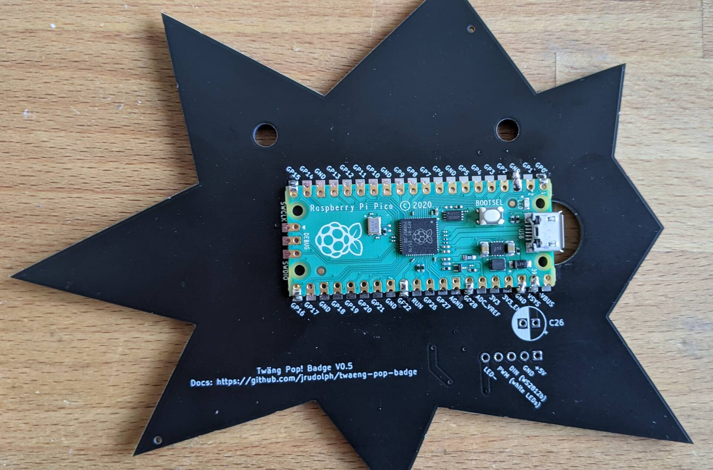
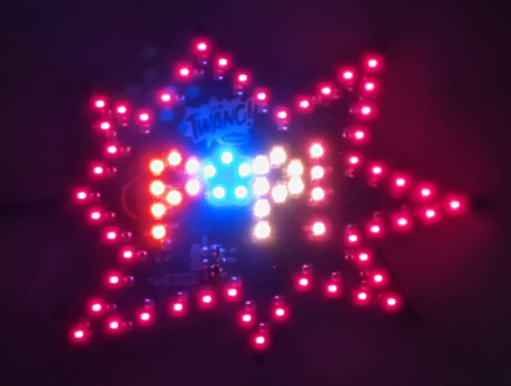
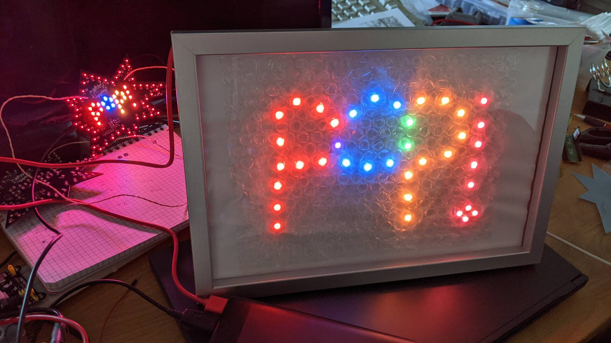

# Twang POP! Badge

These are [KiCad](https://www.kicad.org/) sources from which the Twang POP! Badge was produced. This
is basically version 2 of the blinky sign described [on the blog](https://blog.virtual-void.net/2022/06/17/creating-a-blinky-sign-for-twaeng/).

The updated firmware can be built from the `pop-badge` branch of the [firmware repository](https://github.com/jrudolph/twaeng-pop-sign/tree/pop-badge).

## Schematics

The idea was to keep the basic original design based around a RPi Pico and WS2812b LEDs. For space and
cost reasons the amount of WS2812 LEDs was reduced to 25 and the smaller variant was chosen.

Additionally, 50 simple white LEDs were
added as a frame for the sign. These LEDs can not be controlled individually but only as the whole set. The brightness can be set by choosing appropriate PWM settings. 50 LEDs could consume 1A of
current which is a lot and cannot be sourced from a microcontroller pin directly. Since this was my first
electronics design, I was not totally certain how to set this up properly, so I went with a design, where I put both an NPN-transistor and an N-channel MOSFET on the board configurable via solder
jumpers. (It wasn't clear to me how much current the NPN transistor would really need to switch on all those 50 LEDs. The current gain might be enough to drive those but I wasn't sure what it would mean under PWM and under how much strain it would put the output pin of the Pico.)

I also put a debug header on the board for easy testing of components without requiring to
immediately solder the RPi Pico.

The Pico itself is soldered to the back using its castellated edges. The idea is here, to piggy-back
on the proven design of the Pico and avoid experimenting with a full-fledged MCU design. The Pico has a very flexible input power design based on a switching buck/boost converter, so you can either run via USB or any other power source like AA batteries within a wide range of voltages.

The LED setup is schematically simple:

RGB LEDs:

White LEDs:

## PCB

The PCB has the outline of speech bubble in the form of a star. It uses a two layer design
with most of the back being the ground plane with a small amount of via connections.

On the front are all the LEDs with the required support components. The white LEDs are switched on the low-side (via the N-channel MOSFET), so the outer frame is a fill which goes to the source of the MOSFET. I read that having loops on a PCB will more likely act as an antenna, so I spared out a bit of the fill in the upper-right corner. The anode of the LEDs is directly connected to 5V. The MOSFET is controlled via a MCU pin, using PWM to dim the LEDs. They will never be driven with full power, which would use `50 x 20mA = 1A` (and would be even more blindingly bright).

Here's KiCad's 3D rendering of the front:

On the back there is room to solder the Pico itself to the board, and an electrolytic capacitor to relieve the power source (but it also works reliably without), so I didn't actually place them. I left a half-circle cutout where the USB port of the Pico would be to hopefully allow USB plugs to
fit in more easily. Unfortunately, the cutout is to small to accommodate all kinds of plugs. Some
plugs fit, some don't.

## Final Result

This is how the badges looked in their shiny black solder mask when I unpacked them after production.

Front:

Back:

A first test using after soldering the test headers showed an unexpected result:

The outer frame of LEDs was red but I had ordered white LEDs instead (and also selected the
current limiting resistors based on the white LEDs' specs). After some back and forth, it turned
indeed out to be a production mistake. After quite some discussion, finally the production cost
was waived, I was happy about that even if the visual effect was not quite as intended.

After soldering the Pico to the back, I started [adapting the firmware](https://github.com/jrudolph/twaeng-pop-sign/compare/main...pop-badge) to the new layout. The number of
LEDs had to be adapted and I also created a new rainbow wave animation. This required to
know the position of the RGB LEDs, which [could be extracted](pop-badge/extract-pos.scala) from the placement files that
were needed for the production assembly.

and finally the new version came alive:

Here are old and new version next to each other:

All of the LEDs are blindingly bright, so I experimented with different kinds of sheets to put in
front to diffuse the light a bit and take a bit away from the brightness. The final setup was placed in a small frame behind a sheet of diffusing paper and is now powered with 3 AA batteries (which is also safer than a solution powered by lithium batteries).